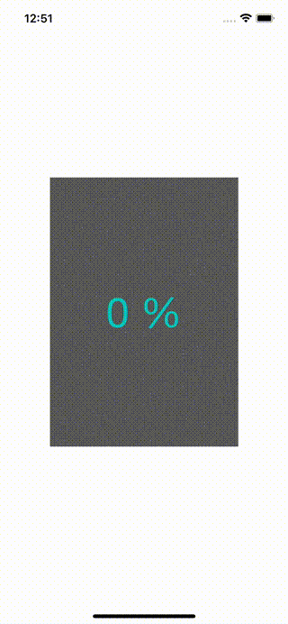

# WWScratchCard
[](https://developer.apple.com/swift/) [](https://developer.apple.com/swift/)  [](https://developer.apple.com/swift/) [](https://developer.apple.com/swift/)

Imitation Scratch Card function.

仿刮刮樂功能。



### [Installation with Swift Package Manager](https://medium.com/彼得潘的-swift-ios-app-開發問題解答集/使用-spm-安裝第三方套件-xcode-11-新功能-2c4ffcf85b4b)

```bash
dependencies: [
    .package(url: "https://github.com/William-Weng/WWScratchCard.git", .upToNextMajor(from: "1.0.0"))
]
```

### Example
```swift
import UIKit
import WWScratchCard

final class ViewController: UIViewController {
    
    @IBOutlet weak var scratchCardView: WWScratchCard!
    
    override func viewDidLoad() {
        super.viewDidLoad()
        demo(contentImagename: "Desktop", coverImagename: "Gray", resetTime: 5.0)
    }
}

private extension ViewController {
    
    func demo(contentImagename: String, coverImagename: String, resetTime: Double) {
        
        let contentView = UIImageView(image: UIImage(named: contentImagename))
        let coverView = UIImageView(image: UIImage(named: coverImagename))

        contentView.contentMode = .scaleAspectFill
        coverView.contentMode = .scaleAspectFill
        scratchCardView.setting(coverView: coverView, contentView: contentView, strokeWidth: 20.0)
        
        DispatchQueue.main.asyncAfter(deadline: .now() + resetTime) {
            self.scratchCardView.clearCanvas()
        }
    }
}
```
